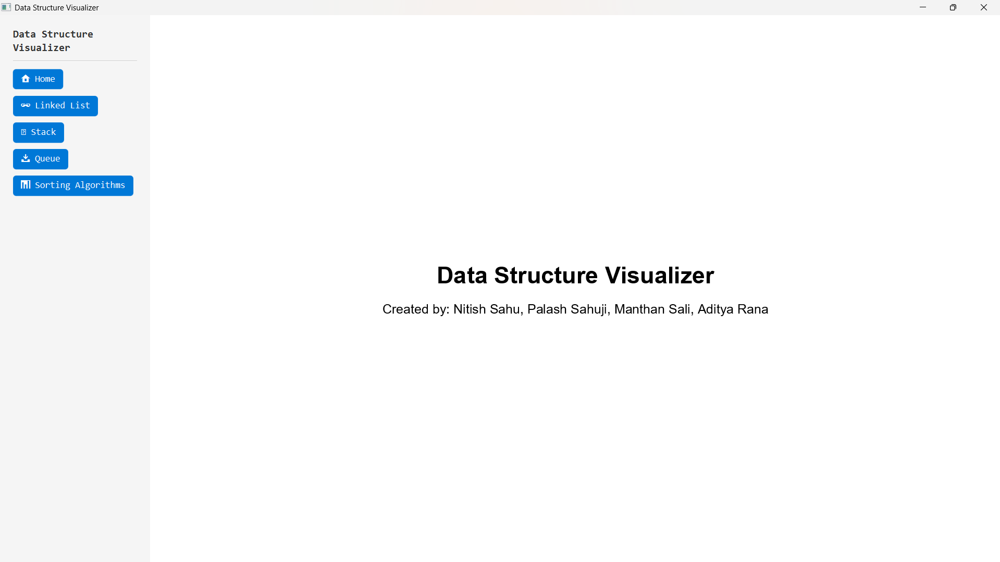
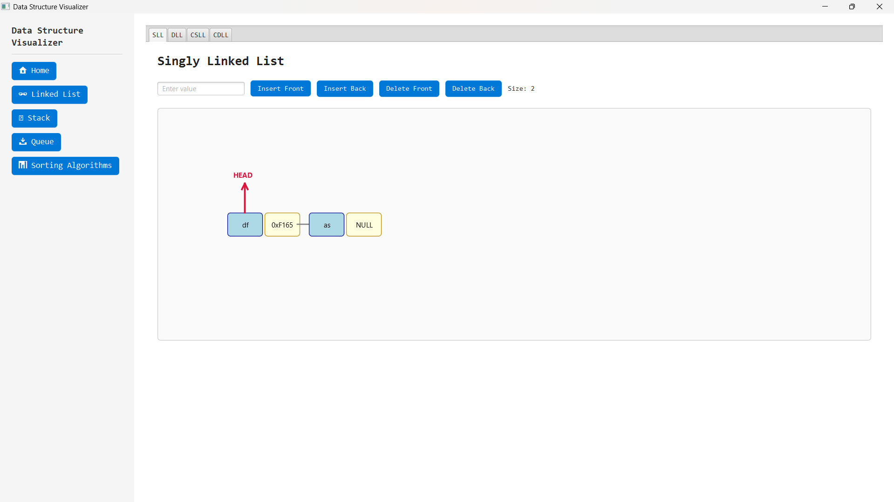
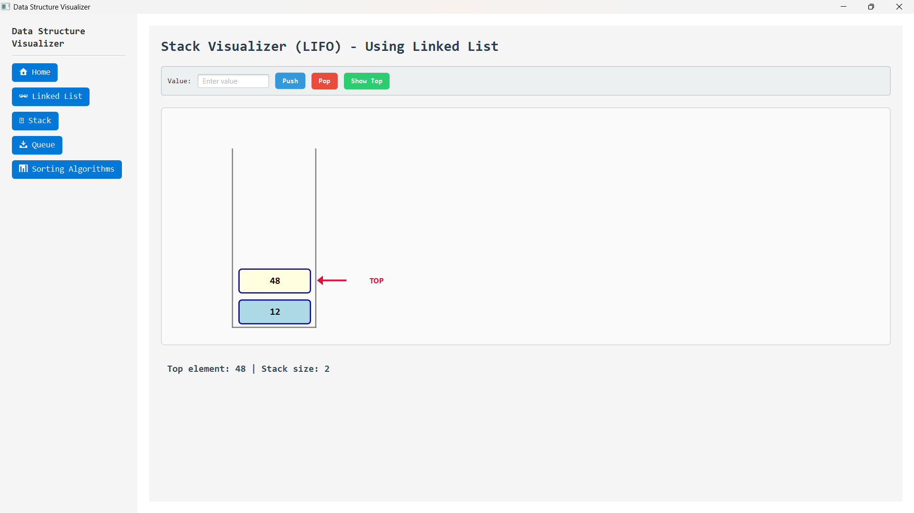
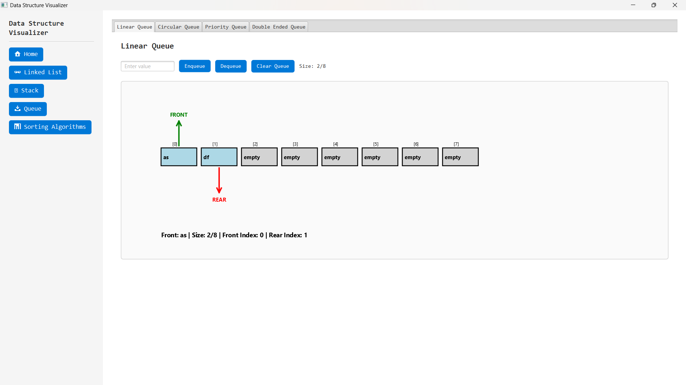
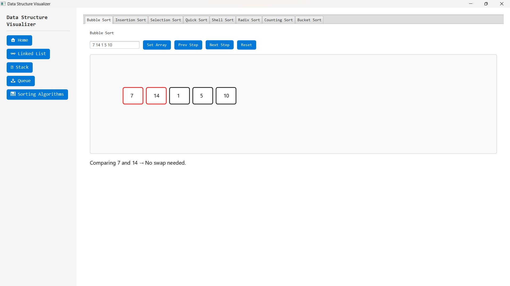

# Data Structures Visualizer

📋 **Project Overview**
A JavaFX-based educational tool that visualizes data structures and sorting algorithms in real-time. It helps students and developers understand algorithms through interactive animations and step-by-step execution.


## 🎯 Core Features

* **Data Structure Visualizers**

    * Singly Linked List, Doubly Linked List, Circular Linked Lists
    * Stack (push/pop animation)
    * Queue (Linear & Circular, enqueue/dequeue animation)

* **Sorting Algorithm Visualizers (8 Algorithms)**

    * Bubble Sort, Insertion Sort, Selection Sort, Quick Sort, Shell Sort
    * Counting Sort, Radix Sort, Bucket Sort

* **UI Features**

    * Dashboard with sidebar navigation
    * Responsive layout
    * Step-by-step controls, color-coded highlights, and operation descriptions

---

## 🔧 Tech Stack

* **Language:** Java 21 LTS
* **GUI Framework:** JavaFX 21
* **Styling:** CSS
* **Architecture:** OOP principles (Inheritance, Polymorphism, Encapsulation)
* **Tools:** IntelliJ IDEA, Git & GitHub

---

## 🚀 How to Run

1. Clone the repo:

```bash
git clone https://github.com/Manthan270706/interactive-data-structure-visualizer
```

2. Open in IntelliJ IDEA and run `Main.java`
3. Alternatively, download the **Windows executable (.exe)** directly from the repo and run it to use without building the project.

---

## 🌟 Screenshots / Demo






